# E-Commerce Back End Application

## Description

For this assignment, I was tasked with building the back end for an e-commerce site by modifying starter code. The main goal of this assignment, was to build a functional database and routes that allowed for adding to, updating, and deleting data from the three main models in that database (products, categories, and tags).

## Installation

Before beginning, I was given quite a bit of starter code but the code I needed to complete were my models and routes. I chose the models to start with so that my routes had actual data to use. 

For each of the models, I viewed the criteria in the readme for what columns each model needed and for the most part was able to just copy that and implement with the correct syntax into the specific model files. Once every model had the necessary data columns and foreign keys, my next step was to connect the models to each other in my index.js file using the belongsTo and hasMany functions. Fortunately, starter code gave me comments specifying which models to connect and where. 

After my models were properly set up, it was time to complete my routes files. For each model, I was tasked with creating GET, PUT, POST, and DELETE routes so that I couyld retrieve, update, an delete data from each model. For the GET routes, I was tasked with retrieving all data from a table as well as just one item depending on the ID. For each model, I used the standard GET routes functions with either findAll or findByPk and then an include statement to retieve data from the other tables that I wanted to include with that table. For my POST routes for my product and tag models, I used an if statement to include the productTags in the new data. For the category model, I just used the .create function to add the body into the table. Lastly, for the DELETE routes, I used the .destroy function to destroy a piece of data based on a specific ID in the route. 

My last task to finish the site was to set up my insomnia. I did so by creating folders in insomnia for each of my models except the ProductTags model. In each folder, I then created http requests for all of the routes, differentiating between GET, PUT, POST, and DELETE, and then put in the necessary URL. For my GET by ID routes, I tested with a random ID in the URL to make sure it worked. For my PUT and DELETE routes, I needed to add a body that matched the columns in the specific model to make sure those routes worked. Once everything was running how I wanted it to, I was done!

## Usage

For a video tutorial on how to run the site click https://app.screencastify.com/v3/watch/7ZmO5gSAQVW01VCMDxm7

Once you are on the command line, the first step is to enter the db folder and create the database using 'psql -U postgres' and installing the schema.sql with '\i schema.sql'.

From there, exit the db folder and run 'npm run seed' to seed the database with the data. Then you can enter 'npm start' to make the server live. Now go to insomnia to test the routes.

When you test 'GET All Products' 'GET All Categories', or 'GET All Tags', you will then see either all of the products, all of the categories, or all of the tags in the database. Each with included data relating to each. 

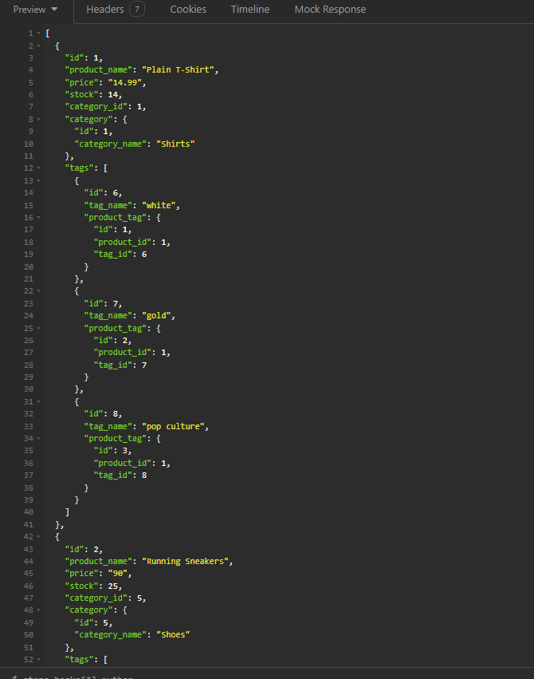
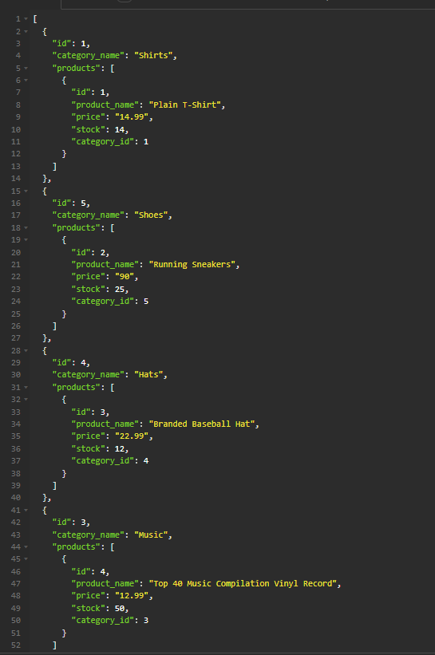
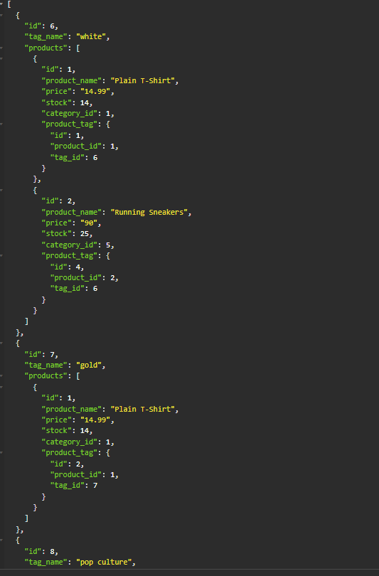

When you test 'GET One Products', "GET Category By ID', 'GET Tag By ID', you will then see just one of either the products, categories, or tags in the database. You can try this for any product, category, or tag by entering their specific ID in place of the number in the URL.

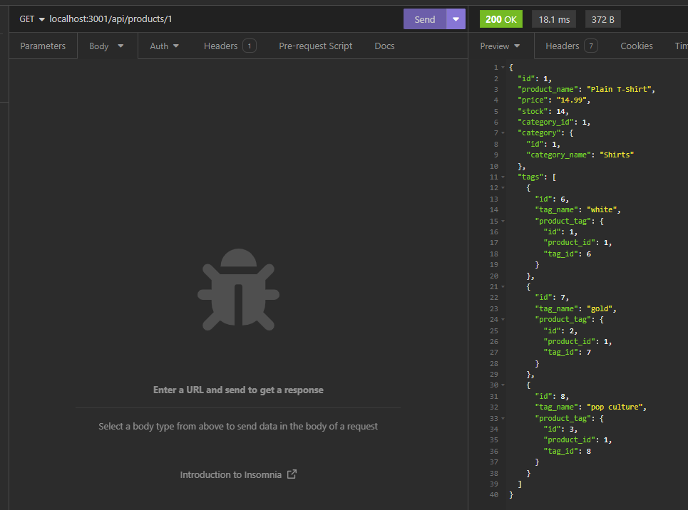
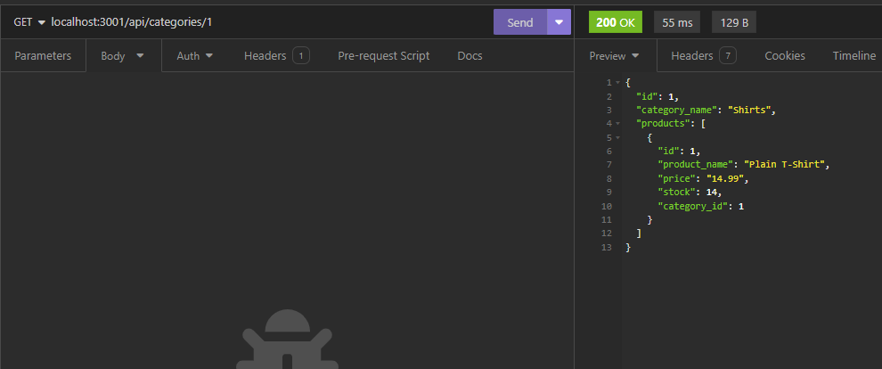
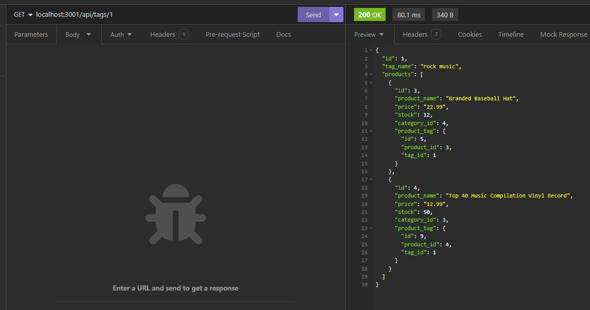

When you test 'CREATE Product', 'CREATE Category', or 'CREATE Tag', you will see a body that will be added to the database. To view this, run one of the 'GET' requests.

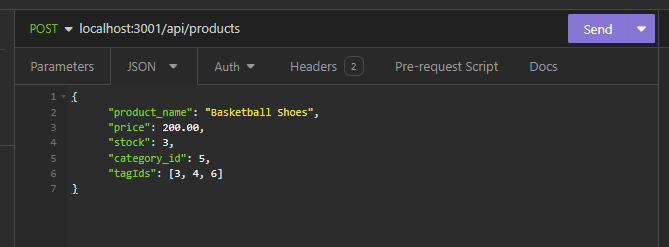
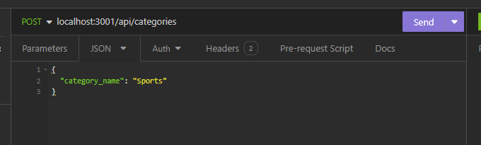
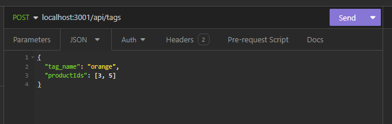

When you test 'UPDATE Product', 'UPDATE Category', or UPDATE Tag', you will see a body that will be replace a piece of data in the database based on the ID in the URL. To view this, run one of the 'GET' requests.

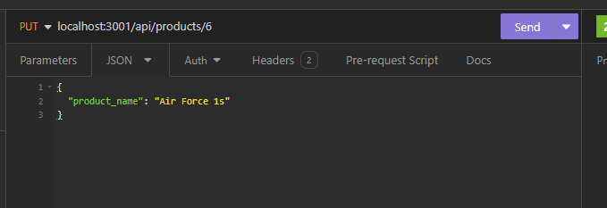
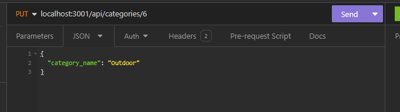
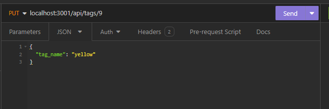

When you test 'DELETE Product', 'DELETE Category', or 'DELETE Tag', you will delete a piece of data in the database based on the ID in the URL. To view this, run one of the 'GET' requests to check if it is still there.

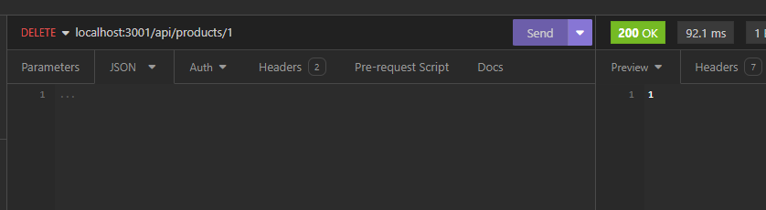
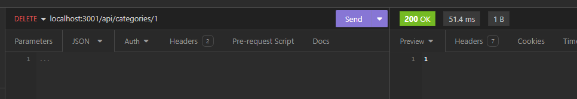
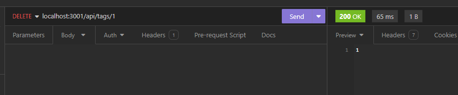